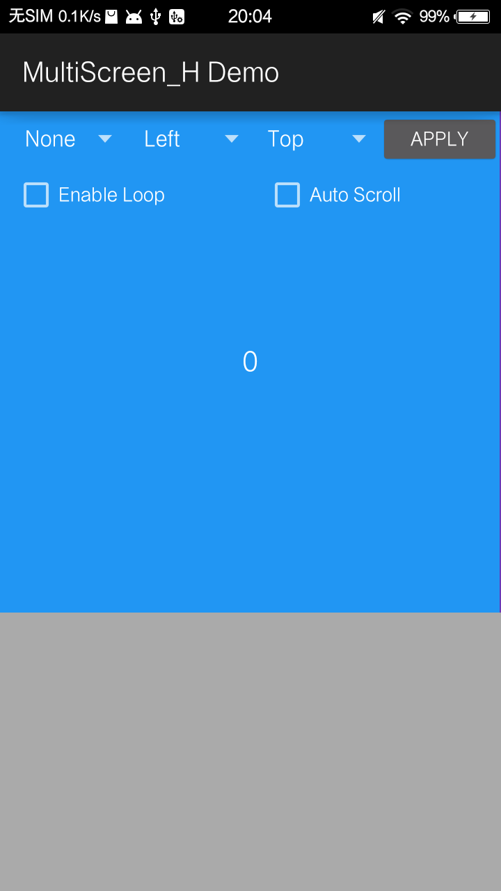
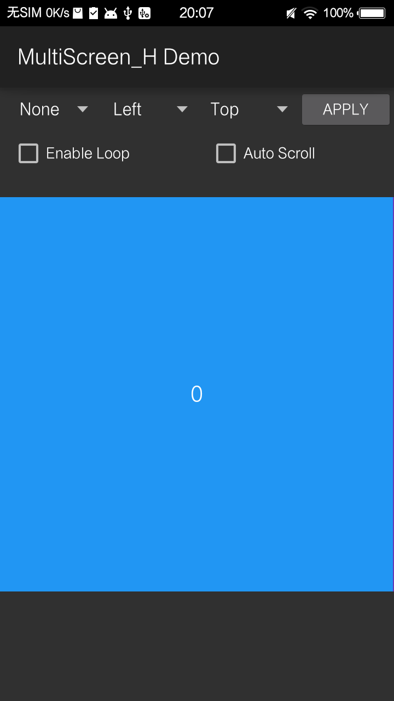
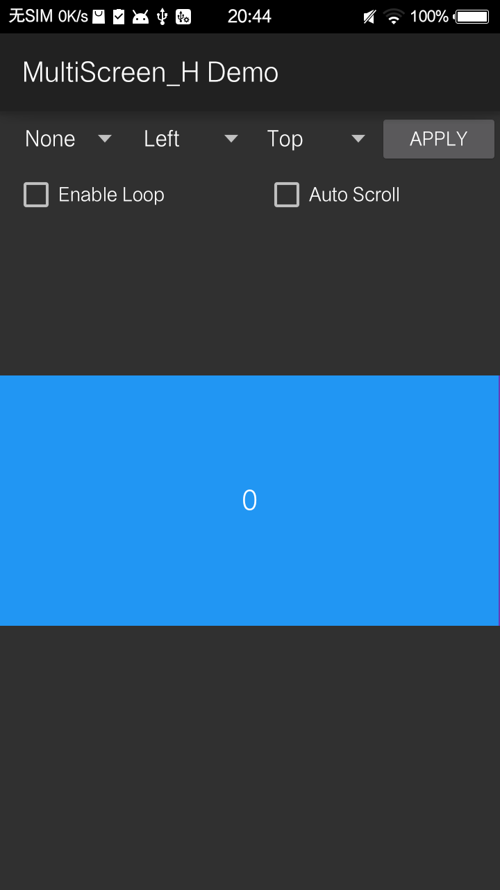

[Englis API](ATTRIBUTES.md)
### initIndicator

初始化indicator，支持链式调用set属性，focusColor, normalColor是必设属性，否则indicator不会显示。
#### 接口
``` 
IUltraIndicatorBuilder initIndicator();
```
---
### setFocusColor setNormalColor
设置indicator 图标颜色。
`focusColor`  被选中的indicator颜色
`normalColor` 未被选中的indicator颜色
#### 接口
``` 
IUltraIndicatorBuilder setFocusColor(int focusColor);
IUltraIndicatorBuilder setNormalColor(int normalColor);
```
```
ultraViewPager.getIndicator()
    .setFocusColor(Color.GREEN)
    .setNormalColor(Color.WHITE)
    .setRadius((int)TypedValue.applyDimension(TypedValue.COMPLEX_UNIT_DIP, 5, getResources().getDisplayMetrics()));
```


---
### setFocusResId setNormalResId
设置indicator 图片资源。
`focusResId`  被选中的indicator icon Id
`normalResId` 未被选中的indicator icon Id
#### 接口
``` 
IUltraIndicatorBuilder setFocusResId(int focusResId);
IUltraIndicatorBuilder setNormalResId(int normalResId);
```
```
ultraViewPager.getIndicator()
.setFocusResId(R.mipmap.tm_biz_lifemaster_indicator_selected)
.setNormalResId(R.mipmap.tm_biz_lifemaster_indicator_normal);
```

---
### setIndicatorPadding

`indicatorPadding` indicator的item之间的间距，默认是item的宽度

#### 接口
``` 
IUltraIndicatorBuilder setIndicatorPadding(int indicatorPadding);
```
---
### build
设置完indicator属性后， 需调用`build`完成创建。

#### 接口
``` 
void build();
```
---
### setMultiScreen
开启一屏多显模式,child view的宽度不占满全屏。
#### 接口
```
void setMultiScreen(float ratio)
```

```
ultraViewPager.setMultiScreen(0.5f);
ultraViewPager.setItemRatio(1.0f);
ultraViewPager.setAutoMeasureHeight(true);
```


---
### setAutoMeasureHeight
使能该功能，UltraViewPager的高度会自动调整到child view的高度。`setRadio` 和 `setAutoMeasureHeight` 不应该同时使用。
#### 接口
```
void setAutoMeasureHeight(boolean enable)
```  

```
ultraViewPager.setMultiScreen(1.0f);//single screen
ultraViewPager.setItemRatio(1.0f);//the aspect ratio of child view equals to 1.0f
ultraViewPager.setAutoMeasureHeight(false);
```


```
ultraViewPager.setMultiScreen(1.0f);
ultraViewPager.setItemRatio(1.0f);
ultraViewPager.setAutoMeasureHeight(true);
```


---
### setItemRatio
设置后会以此宽高比调整child view的高度。
#### 接口

```
void setItemRatio(double ratio)
``` 

---
 
### setRatio
以设定的宽高比来绘制UltraViewPager。`setRatio`优先级高于`setItemRatio`.
#### 接口
```
void setRatio(float ratio)
```
```
ultraViewPager.setMultiScreen(1.0f);//single screen
ultraViewPager.setRatio(2.0f);//the aspect ratio of viewpager  equals to 2.0f
ultraViewPager.setAutoMeasureHeight(true);
```



