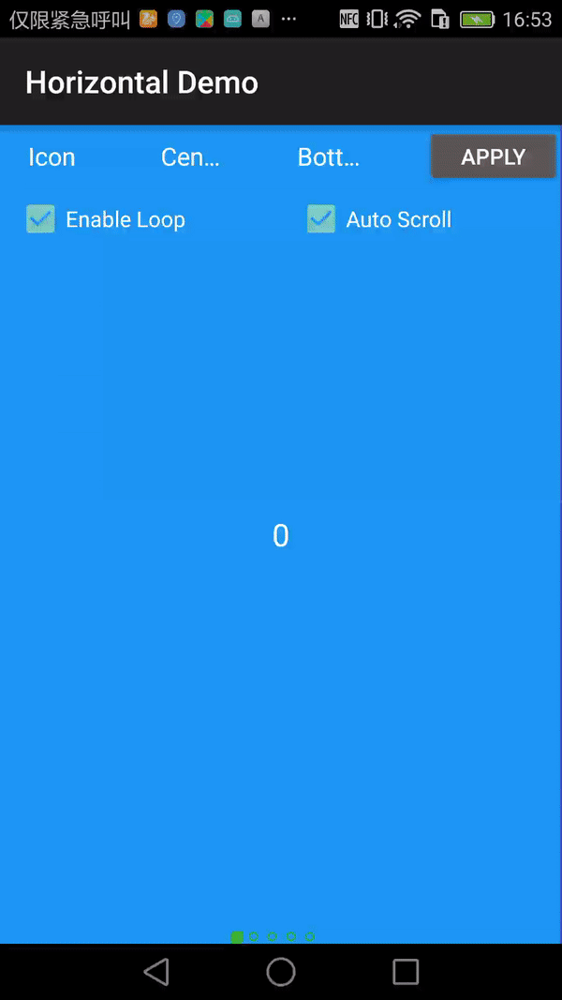
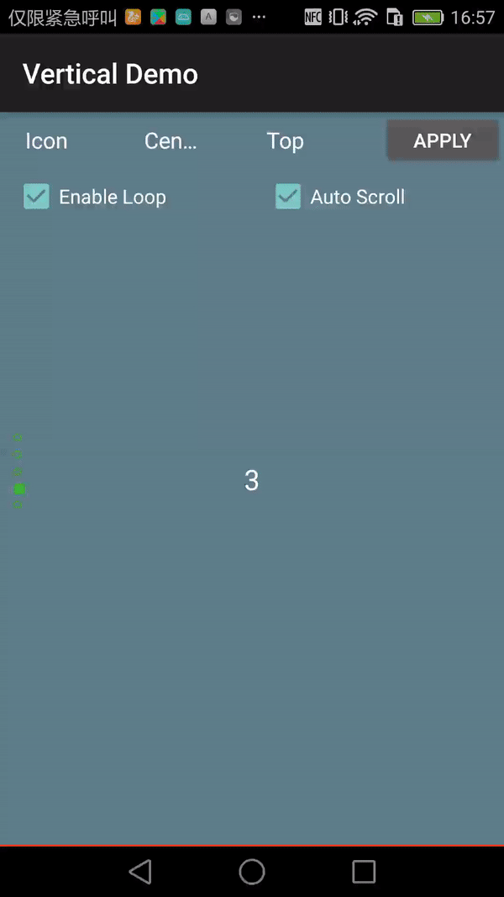
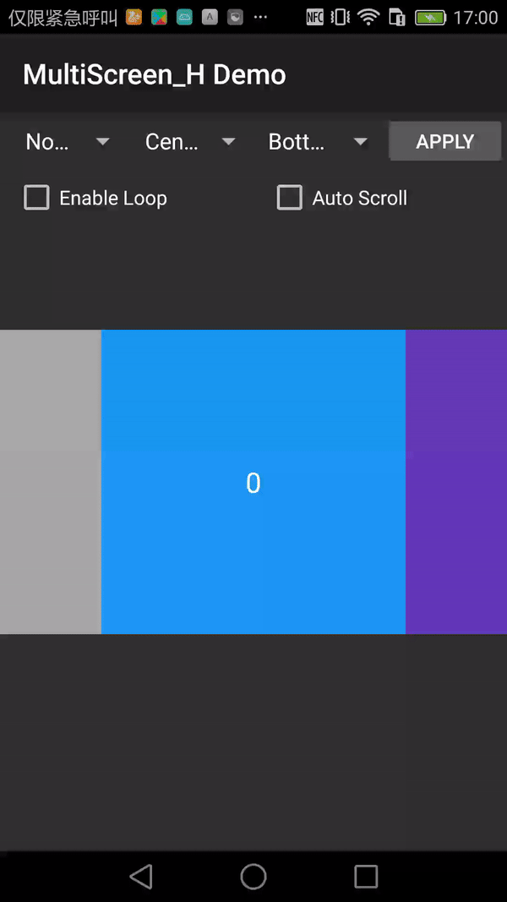
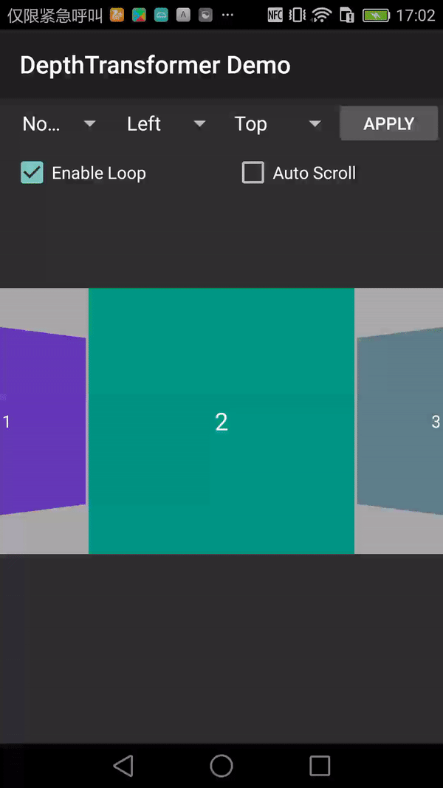

### UltraViewPager

[中文文档](README-ch.md)

Project`UltraViewPager` is a ViewPager extension that encapsulates multiple features, mainly to provide a unified solution for multi-page switching scenarios.







#### Main Feature

* support horizontal scrolling and vertical scrolling
* support multi views in one viewpager
* support switching views circularly. For example, if there are 3 views to display in a ViewPager, it should switch back to the first view after the third view.
* support auto-scrolling feature，implemented timer with Handler.
* support setting max-height and  max-width for this ViewPager.
* support setting the aspect ratio for UltraViewPager.
* UltraViewPager has a built-in indicator. support circle and icon style.
* built-in two kind of page tansition animation.

you can combine multiple features at the same time.

#### Design
UltraViewPager is a super extension for ViewPager.
It's actually a RelativeLayout in order to display ViewPager and Indicator.UltraViewPager offers some common method delegate for ViewPager, you can also invoke more method by call getViewPager() and get the actual ViewPager.

In order to achieve vertical scroll, through exchanging MotionEvent in onInterceptTouchEvent and onTouchEvent.For more details, you can read the source code.

#### Usage

Please find the latest version(1.0.0 so far) in maven repository. The newest version has been upload to jcenter and MavenCantral, make sure you have added at least one of these repositories.

Using Gradle:

```
//gradle
compile ('com.alibaba.android:ultraviewpager:1.0.0@aar') {
	transitive = true
}
```
or grab via Maven:

```
//pom.xml in maven
<dependency>
  <groupId>com.alibaba.android</groupId>
  <artifactId>ultraviewpager</artifactId>
  <version>1.0.0</version>
  <type>aar</type>
</dependency>

```

Create your own layout using a UltraViewPager:

activity_pager.xml

```xml
<com.tmall.ultraviewpager.UltraViewPager
    android:id="@+id/ultra_viewpager"
    android:layout_width="match_parent"
    android:layout_height="wrap_content"
    android:layout_centerInParent="true"
    android:background="@android:color/darker_gray" />

```

You can follow my tutorial below on how to use UltraViewPager:

```
UltraViewPager ultraViewPager = (UltraViewPager)findViewById(R.id.ultra_viewpager);
ultraViewPager.setScrollMode(UltraViewPager.ScrollMode.HORIZONTAL);
//initialize UltraPagerAdapter，and add child view to UltraViewPager
PagerAdapter adapter = new UltraPagerAdapter(false);
ultraViewPager.setAdapter(adapter);

//initialize built-in indicator
ultraViewPager.initIndicator();
//set style of indicators
ultraViewPager.getIndicator()
    .setOrientation(UltraViewPager.Orientation.HORIZONTAL)
    .setFocusColor(Color.GREEN)
    .setNormalColor(Color.WHITE)
    .setRadius((int)TypedValue.applyDimension(TypedValue.COMPLEX_UNIT_DIP, 5, getResources().getDisplayMetrics()));
//set the alignment
ultraViewPager.getIndicator().setGravity(Gravity.CENTER_HORIZONTAL | Gravity.BOTTOM);
//construct built-in indicator, and add it to  UltraViewPager
ultraViewPager.getIndicator().build();

//set an infinite loop
ultraViewPager.setInfiniteLoop(true);
//enable auto-scroll mode
ultraViewPager.setAutoScroll(2000);

```
For other API reference,see [this](ATTRIBUTES.md) to read more.

#### DEMO

[Demo Project](https://github.com/alibaba/UltraViewPager/tree/master/examples)

# Contributing

Before you open an issue or create a pull request, please read [Contributing Guide](CONTRIBUTING.md) first.

#### LICENSE
`UltraViewPager` is available under the MIT license.


